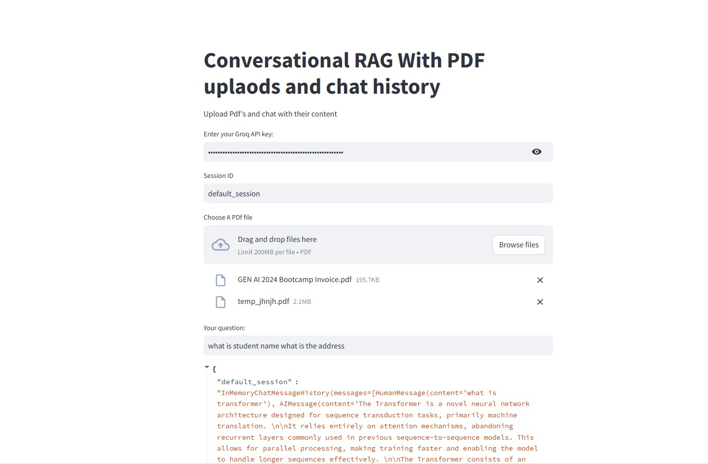

This is a Streamlit application that enables conversational question-answering with PDF uploads and chat history. Here's a breakdown of the code:

## Importing Libraries and Setting Up Environment

The code starts by importing various libraries, including:

streamlit for building the web application
langchain for natural language processing and question-answering
dotenv for loading environment variables from a .env file
The code sets up environment variables for Langsmith tracking and Hugging Face token.

## Streamlit Setup

The code sets up a Streamlit application with a title, a text input for the Groq API key, and a file uploader for PDF files.

## Groq API Key Input

The user is prompted to enter their Groq API key. If the key is provided, the code proceeds to set up the language model and chat interface.

## Language Model and Chat Interface

The code sets up a ChatGroq language model with the provided Groq API key and a Gemma2-9b-It model.

The chat interface is set up with a text input for the user's question and a session ID input.

## PDF Upload and Processing

When the user uploads one or more PDF files, the code processes them using the following steps:

Saves the uploaded PDF files to a temporary location.
Uses PyPDFLoader to load the PDF files and extract text.
Splits the text into chunks using RecursiveCharacterTextSplitter.
Creates embeddings for the chunks using HuggingFaceEmbeddings.
Creates a FAISS vector store from the embeddings.
Retriever and Question-Answering Chain

The code sets up a retriever that uses the vector store to retrieve relevant chunks of text based on the user's question. It also sets up a question-answering chain that uses the retriever and a language model to answer the user's question.

## Contextualizing Questions

The code defines a prompt template to contextualize the user's question based on the chat history. This is done to reformulate the question to make it standalone and understandable without the chat history.

## Answering Questions

The code defines another prompt template to answer the user's question using the retrieved context. The answer is generated using the language model and the retrieved context.

## Conversational RAG Chain

The code sets up a conversational RAG (Retrieval-Augmented Generation) chain that combines the retriever, question-answering chain, and chat history. This chain is used to generate answers to the user's questions while taking into account the chat history.

## Running the Conversational RAG Chain

When the user inputs a question, the code runs the conversational RAG chain to generate an answer. The answer is displayed to the user, along with the updated chat history.